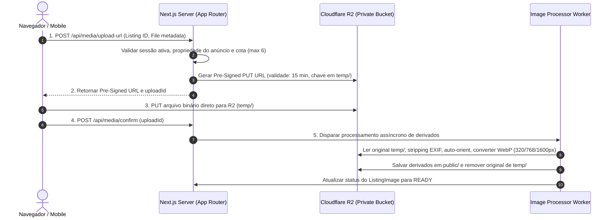

# Documento de Arquitetura: Pipeline de Imagens R2 (F2-007)

Este documento especifica o design técnico, execução, política de privacidade e regras de retenção para o pipeline de armazenamento e processamento de imagens do TROQ (Issue #45 / F2-007).

---

## 1. Visão Geral da Arquitetura de Mídia

O armazenamento de objetos utiliza o **Cloudflare R2** (API S3-compatible, [ADR-0003](../adr/0003-object-storage-r2.md)), operando sob buckets estritamente **privados** (`troq-media-development`, `troq-media-preview`).

> [!CAUTION]
> **Privacidade de Originais**: Buckets públicos são terminantemente proibidos. Os arquivos originais enviados pelo cliente nunca são expostos publicamente. Apenas derivados processados (WebP) têm URLs públicas expostas e sua acessibilidade é condicional ao estado do anúncio.

---

## 2. Limites Técnicos e Validações de Entrada

| Parâmetro | Restrição | Ação em caso de violação |
|---|---|---|
| **Tamanho máximo de arquivo** | 10 MB | Rejeição antes do upload no cliente e no Pre-Signed Content-Length |
| **Dimensões mínimas** | 320 x 320 px (pós-orientação) | Rejeição no processador com status `FAILED` |
| **Teto máximo de megapixels** | 50 Megapixels | Rejeição no processador para evitar estouro de memória |
| **Formatos aceitos** | JPEG, PNG, WebP estáticos | Rejeição de formatos animados (GIF/WebP multipage) e vetoriais (SVG) |
| **Quantidade por anúncio** | Máximo de 6 imagens | Validação server-side estrita sob concorrência |

---

## 3. Derivados e Especificação de Processamento

Cada imagem validada com sucesso gera exatamente 3 variantes no formato **WebP (qualidade 80)**:

1. **`thumb`**: Resolução máxima de 320 px (lado maior), preservando a proporção de tela sem upscaling. Usada em cards de listagem e miniaturas.
2. **`medium`**: Resolução máxima de 768 px (lado maior). Usada na galeria principal mobile.
3. **`large`**: Resolução máxima de 1600 px (lado maior). Usada em zoom e telas desktop.

### Metadados e Orientação
- **EXIF e GPS**: Todos os metadados EXIF, localização GPS e informações do dispositivo são **completamente removidos** durante o re-encoding.
- **Auto-Orientação**: A orientação EXIF é aplicada à matriz de pixels antes da remoção dos metadados.

---

## 4. Controle de Acesso e Revogação Imediata

A visibilidade pública dos derivados é **estritamente vinculada ao estado do anúncio** e à elegibilidade da conta do anunciante.

- **`PUBLISHED` (Ativo)**: Derivados acessíveis via CDN / Next.js Image Optimization.
- **`DRAFT` / `PAUSED` / `CLOSED` / `REMOVED`**: Acesso público **imediatamente revogado**. Tentativas de acesso retornam `404 Not Found` ou `403 Forbidden`.

> [!IMPORTANT]
> A transição de um anúncio para `PAUSED` ou `CLOSED` deve invalidar as chaves de derivados nas bordas (edge caches / CDN) e no otimizador de imagens do Next.js sem executar exclusão destrutiva dos arquivos de derivados durante o período de pausa.

---

## 5. Regras de Limpeza e Retenção Automatizada

1. **Uploads Temporários Abandonados**: Originais na pasta `temp/` não confirmados ou com falha de processamento são purgados automaticamente após **24 horas**.
2. **Exclusão de Originais**: Arquivos originais em `temp/` são deletados imediatamente após a geração e persistência bem-sucedida das 3 variantes derivadas.
3. **Expurgo de Derivados (30 Dias)**: Quando um anúncio transita permanentemente para `CLOSED` ou `REMOVED`, seus arquivos derivados associados em `public/` são agendados para expurgo definitivo do bucket R2 em **30 dias**, respeitando o período de auditoria e resolução de disputas.
